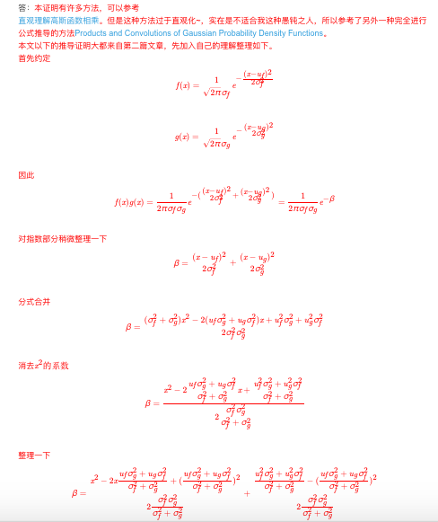
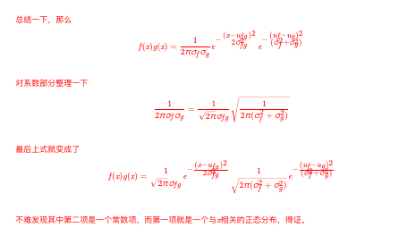

# 习题解答

**1、推导式(13.6)。**

参考资料：[答案来源](https://blog.csdn.net/u012348774/article/details/84568737)

证明思路：利用两个高斯分布的相乘，进行直接化简即可得证。






**2、把本讲的稠密深度估计改成半稠密，你可以先把梯度明显的地方筛选出来。**

参考资料：https://www.cnblogs.com/cc111/p/9688441.html

由于需要将梯度明显的地方筛选出来，因此只需要将dense_mapping中update函数的for循环最开始，即“//遍历每个像素”前面加上以下代码即可：

```cpp
// 将稠密深度估计改成半稠密深度估计，把梯度明显的地方筛选出来
Eigen::Vector2d gradient(
    ref.ptr<uchar>(y)[x+1]-ref.ptr<uchar>(y)[x-1],
    ref.ptr<uchar>(y+1)[x]-ref.ptr<uchar>(y-1)[x]);
if(gradient.norm()<10) continue; // 50
```

其中10和50是可以人为设置的阈值，用来筛选梯度，以下给出两种阈值下的深度估计结果：

当设置梯度阈值为10时：


当设置梯度阈值为50时：


在运行过程中发现，设置阈值为50时系统很快就收敛了，设置阈值为10时则慢很多。这符合逻辑，阈值越大，表示对梯度值的要求越高，因此符合要求的点越少，计算复杂度低，因此收敛快。

以上代码具体可见ch13/dense_monocular/dense_mapping.cpp。


**3、把本讲演示的单目稠密重建代码，从正深度改成逆深度，并添加仿射变换。你的实验效果是否有改进?**


**4、你能论证如何在八叉树中进行导航或路径规划吗？**

导航与路径规划的本质是如何在地图上实现从A点移动到B点，因此主要解决定位、规划和碰撞检测三个问题。前两个都有成熟的算法可以应用，对于八叉树地图来说，主要难点在于如何针对空间环境的八叉树结构设计碰撞检测算法。由于八叉树地图将空间环境进行迭代的划分，当划分层级足够多时，地图的精度就可以达到很高，足以实现小物体的建模，从而可以根据空间环境的occupancy情况设计对应的碰撞检测算法，最终实现导航或路径规划。


**5、研究[120]，探讨TSDF地图是如何进行位姿估计和更新的。它和我们之前讲过的定位建图算法有何异同？**

参考资料：https://www.cnblogs.com/zonghaochen/p/8325905.html

文献120为KinectFusion，其位姿估计是通过ICP的方式实现的，具体为point-to-plane的方式，即要把点到点的距离向法向量投影，示意图见下方（具体待研究）：


TSDF的更新是通过加权平均的方式实现的，具体为对于每一个新的帧，获得其SDF值，同时确定权重，具体方法为voxel越正对着相机，越靠近相机，权重越大。具体算法实现流程见下方（待研究）：


与之前的定位建图算法的异同：

- 相同点：都是通过融合过去和当前帧的数据进行更新；
- 不同点：Octomap是通过高斯概率相乘的方式进行融合更新，这里是通过加权平均的方式。此外两者的表征不同，Octomap是以八叉树来表征环境，这里则是用TSDF的形式（空间点与表面的关系）来建模环境的。


**6、研究均匀——高斯混合滤波器的原理与实现。**

参考资料：https://blog.csdn.net/xiaoxiaowenqiang/article/details/80720767

均匀-高斯混合滤波器是高斯滤波器的改进版，用于获得更好的深度值，在SVO中即采用了这种滤波器。其原理为：在之前单纯假设深度符合高斯分布的基础上，加入了噪声的估计，并假设噪声符合均匀分布；同时将问题建模成有噪声的多传感器数据融合问题，因为最后的深度图是由n张图像获得的，可以看作来自于n个深度传感器。因此假设能获得好的测量值的概率为pi，之后使用贝叶斯方法不断更新这个模型，让点的深度（也就是正态分布中的均值参数）和好的测量值的比例pi收敛到真实值。（具体待研究）


# 参考文献

- 高斯分布相乘：https://blog.csdn.net/u012348774/article/details/84568737
- 筛选梯度：https://www.cnblogs.com/cc111/p/9688441.html
- TSDF：https://www.cnblogs.com/zonghaochen/p/8325905.html
- 均匀-高斯混合滤波器：https://blog.csdn.net/xiaoxiaowenqiang/article/details/80720767