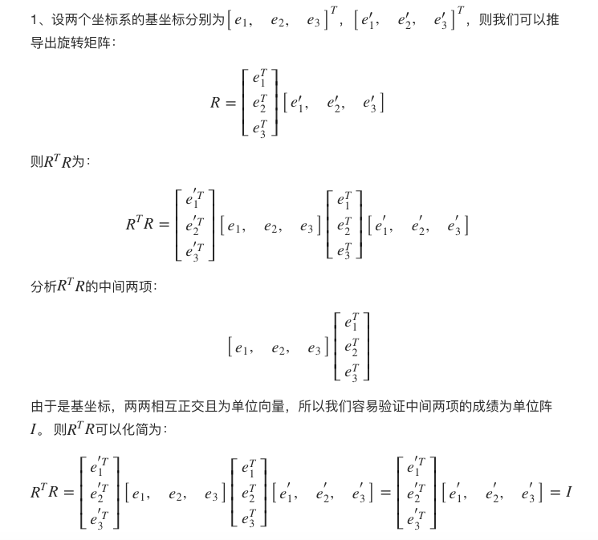
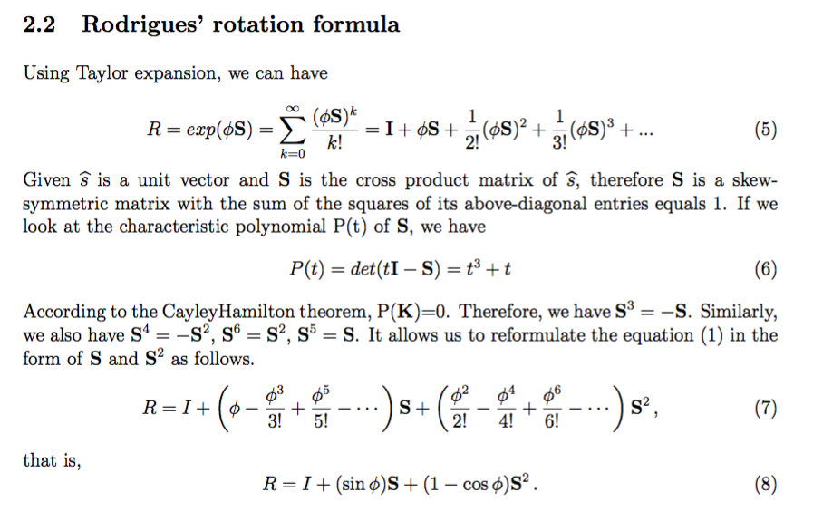
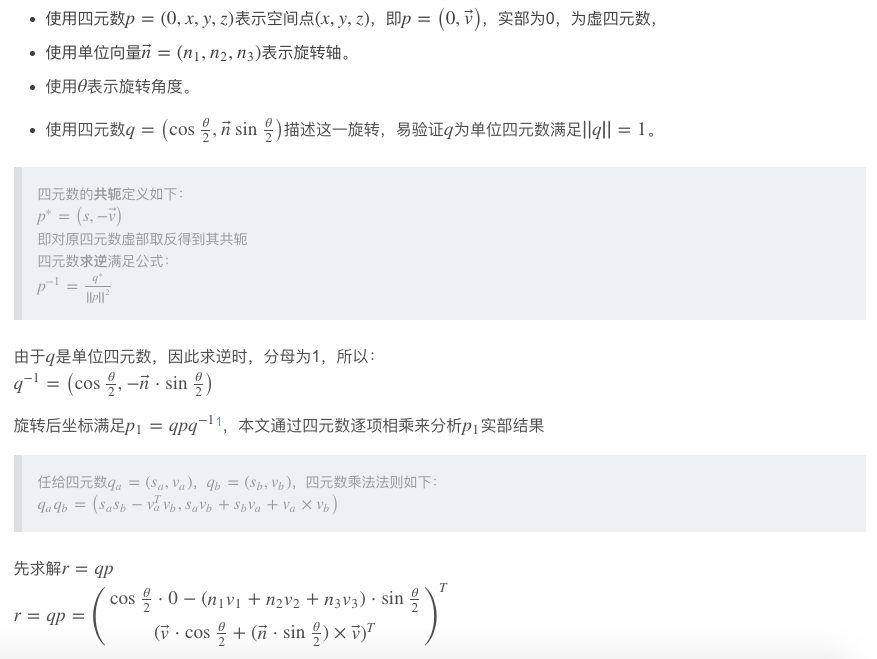
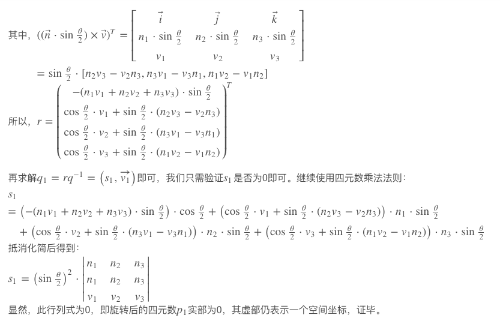
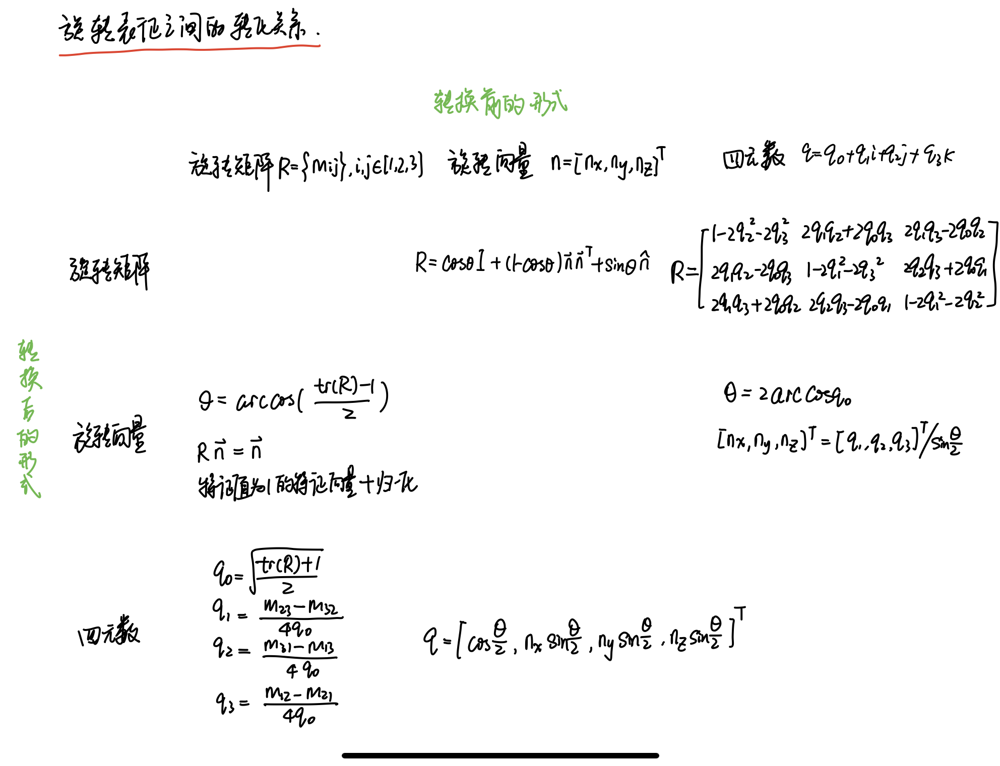

# 习题解答

1、验证旋转矩阵是正交矩阵。

参考资料：[答案来源](https://www.xlmaverick.me/post/%E4%B8%89%E7%BB%B4%E7%A9%BA%E9%97%B4%E7%9A%84%E5%88%9A%E4%BD%93%E8%BF%90%E5%8A%A8/)


证明矩阵为正交矩阵，即证明A^T*A=I。证明思路为根据坐标系的基向量写出旋转矩阵的定义，之后用矩阵乘法得证，具体证明过程见下图。


2、寻找罗德里格斯公式的推导过程并理解它。

摘取了在伯克利计算机视觉课程作业的解答，其中reformulate the equation (1)应该改为(5)。



以上方法是基于Taylor展开的方式，也有方法是基于坐标轴的旋转表示，请见[博客](https://zhuanlan.zhihu.com/p/31775921)。


3、验证四元数旋转某个点后，结果是一个虚四元数(实部为零)，所以仍然对应到一个三维空间点（式3.34）。

参考资料：[答案来源](https://blog.csdn.net/gxsheen/article/details/79156817)

证明逻辑为根据公式(3.34)进行四元数的相乘、求逆等运算，最后计算得到的四元数的实数部分的系数，可以得到最后系数为0，因此仍然是虚四元数，具体推导过程请见下图。






4、画表总结旋转矩阵、轴角、欧拉角、四元数的转换关系。




5、假设我有一个大的Eigen矩阵，我想把它的左上角 3 × 3 的块取出来，然后赋值为I_3×3。请编程实现此事。

参考资料：

- https://blog.csdn.net/jiahao62/article/details/80655542
- https://www.cnblogs.com/newneul/p/8306430.html

```cpp
#include <iostream>
using namespace std;
#include <Eigen/Core>
#include <Eigen/Dense>

#define MATRIX_SIZE 50

int main( int argc, char** argv )
{
    Eigen::Matrix<double, MATRIX_SIZE, MATRIX_SIZE> matrix_NN = Eigen::MatrixXd::Random( MATRIX_SIZE, MATRIX_SIZE );
    cout << "before assign " << endl << matrix_NN.block(0, 0, 3, 3) << endl;
    Eigen::Matrix3d matrix_33 = Eigen::Matrix3d::Identity();
    matrix_NN.block(0, 0, 3, 3) = matrix_33;
    cout << "after assign "  << endl << matrix_NN.block(0, 0, 3, 3) << endl;

    return 0;
}
```

terminal output

```bash
before assign 
 -0.999984    0.53299   0.074608
 -0.736924 -0.0445365 -0.0641653
  0.511211  -0.524451  -0.425575
after assign 
1 0 0
0 1 0
0 0 1
```

6、一般线程方程 Ax = b 有哪几种做法？你能在Eign中实现吗？

参考资料：https://www.cnblogs.com/newneul/p/8306442.html

```cpp
// 求解Ax=b
Eigen::Matrix<double, EQUATION_NUM, VARIABLE_NUM> A = Eigen::MatrixXd::Random(EQUATION_NUM, VARIABLE_NUM);
Eigen::Matrix<double, EQUATION_NUM, 1> b = Eigen::MatrixXd::Random(EQUATION_NUM, 1);
// 测试用例
A << 10,3,1,2,-10,3,1,3,10;
b << 14,-5,14;
// 设置解变量
Eigen::Matrix<double, VARIABLE_NUM, 1> x;

clock_t time_stt = clock(); // 计时
    
// 方法一：直接求逆，适用条件：方阵
x = A.inverse()*b;
cout <<"time use in normal inverse is "   << 1000* (clock() - time_stt)/(double)CLOCKS_PER_SEC << "ms"<< endl;
    
// 方法二：QR分解，适用条件：方阵和非方阵
// 当方程组有解时的出的是真解，若方程组无解得出的是近似解
time_stt = clock();
x = A.colPivHouseholderQr().solve(b);
cout << "x^T = " << x.transpose() <<endl;
cout <<"time use in Qr decomposition is " << 1000* (clock() - time_stt)/(double)CLOCKS_PER_SEC <<"ms" << endl;

// 方法三：最小二乘法，适用条件：方阵和非方阵
// 方程组有解时得出真解，否则是最小二乘解(在求解过程中可以用QR分解 分解最小二成的系数矩阵)
time_stt = clock();
x = (A.transpose() * A ).inverse() * (A.transpose() * b);
cout << "x^T = " << x.transpose() <<endl;
cout <<"time use in least square is "     << 1000* (clock() - time_stt)/(double)CLOCKS_PER_SEC <<"ms" << endl;

// 方法四：LU分解法，适用条件：方阵
// 满足分解的条件才行
time_stt = clock();
x = A.lu().solve(b);
cout << "x^T = " << x.transpose() <<endl;
cout <<"time use in LU decomposition is " << 1000* (clock() - time_stt)/(double)CLOCKS_PER_SEC <<"ms" << endl;

// 方法五：Cholesky分解法，适用条件：方阵
// 结果与其他的方法差好多，如此简单的也错了。。
time_stt = clock();
x = A.llt().solve(b);
cout << "x^T = " << x.transpose() <<endl;
cout <<"time use in Cholesky decomposition is " << 1000* (clock() - time_stt)/(double)CLOCKS_PER_SEC <<"ms" << endl;

// 方法六：Jacobi迭代法，挖坑待补充。。
```

terminal output

```bash
time use in normal inverse is 0.009ms
x^T = 1 1 1
time use in Qr decomposition is 0.342ms
x^T = 1 1 1
time use in least square is 0.024ms
x^T = 1 1 1
time use in LU decomposition is 0.151ms
x^T =  1.39918 -0.04722   0.1026
time use in Cholesky decomposition is 0.047ms
```


7、设有小萝卜一号和小萝卜二号位于世界坐标系中。小萝卜一号的位姿为：q1 = [0.35, 0.2, 0.3, 0.1]，t1 =  	[0.3, 0.1, 0.1]^T (q 的第一项为实部。请你把 q 归一化后再进行计算)。这里的 q 和 t 表达的是 Tcw，也就是世界到相机的变换关系。小萝卜二 号的位姿为：q2 = [−0.5,0.4,−0.1,0.2]，t2 = [−0.1,0.5,0.3]^T。现在，小萝卜一号看到某个点在自身的坐标系下，坐标为 p = [0.5, 0, 0.2]^T ，求该向量在小萝卜二号坐标系下的坐标。请编程实现此事。

参考资料：

- https://www.xlmaverick.me/post/%E4%B8%89%E7%BB%B4%E7%A9%BA%E9%97%B4%E7%9A%84%E5%88%9A%E4%BD%93%E8%BF%90%E5%8A%A8/
- https://blog.csdn.net/jiahao62/article/details/80655542

```cpp
// 坐标变换
Eigen::Quaterniond q1(0.35, 0.2,  0.3, 0.1);
cout << "quaternion 1 = \n" << q1.coeffs() << endl;
Eigen::Quaterniond q2(-0.5, 0.4, -0.1, 0.2);
cout << "quaternion 2 = \n" << q2.coeffs() << endl;
q1.normalize(); // remember to normalize
q2.normalize();
cout << "normalized quaternion 1 = \n" << q1.coeffs() << endl;
cout << "normalized quaternion 2 = \n" << q2.coeffs() << endl;
Eigen::Vector3d t1(0.3, 0.1, 0.1), t2(-0.1, 0.5, 0.3);
    
// 注意下标，T1w表示world to 1！
Eigen::Isometry3d T1w(q1); // 初始化方法一
// Eigen::Isometry3d T1w(q1.toRotationMatrix()); // 初始化方法二
// Eigen::Isometry3d T1w = Eigen::Isometry3d::Identity(); 
// T1w.rotate(q1.toRotationMatrix()); // 初始化方法三
T1w.pretranslate(t1);
cout << "Transform matrix 1 = \n" << T1w.matrix() <<endl;
// world to 2
Eigen::Isometry3d T2w(q2);
T2w.pretranslate(t2);
cout << "Transform matrix 2 = \n" << T2w.matrix() <<endl;

Eigen::Vector3d p1(0.5, 0, 0.2);
// first from 1 to world, then world to 2
Eigen::Vector3d p2 = T2w * T1w.inverse() * p1; 
cout << "coordinate in camera 2 is \n" << p2.transpose() << endl;
```

terminal output

```bash
quaternion 1 = 
 0.2
 0.3
 0.1
0.35
quaternion 2 = 
 0.4
-0.1
 0.2
-0.5
normalized quaternion 1 = 
0.39036
0.58554
0.19518
0.68313
normalized quaternion 2 = 
 0.589768
-0.147442
 0.294884
 -0.73721
Transform matrix 1 = 
  0.238095   0.190476   0.952381        0.3
   0.72381   0.619048  -0.304762        0.1
 -0.647619   0.761905 0.00952381        0.1
         0          0          0          1
Transform matrix 2 = 
 0.782609   0.26087  0.565217      -0.1
-0.608696  0.130435  0.782609       0.5
 0.130435 -0.956522   0.26087       0.3
        0         0         0         1
coordinate in camera 2 is 
-0.0309731    0.73499   0.296108
```

# 参考文献

- R*R^T=I：https://www.xlmaverick.me/post/%E4%B8%89%E7%BB%B4%E7%A9%BA%E9%97%B4%E7%9A%84%E5%88%9A%E4%BD%93%E8%BF%90%E5%8A%A8/
- 罗德里格斯公式推导：https://zhuanlan.zhihu.com/p/31775921
- 四元数旋转证明：https://blog.csdn.net/gxsheen/article/details/79156817
- Eigen提取block：https://blog.csdn.net/jiahao62/article/details/80655542
- Eigen提取block：https://www.cnblogs.com/newneul/p/8306430.html
- Ax=b求解：https://www.cnblogs.com/newneul/p/8306442.html
- 坐标变换：https://www.xlmaverick.me/post/%E4%B8%89%E7%BB%B4%E7%A9%BA%E9%97%B4%E7%9A%84%E5%88%9A%E4%BD%93%E8%BF%90%E5%8A%A8/
- 坐标变换：https://blog.csdn.net/jiahao62/article/details/80655542